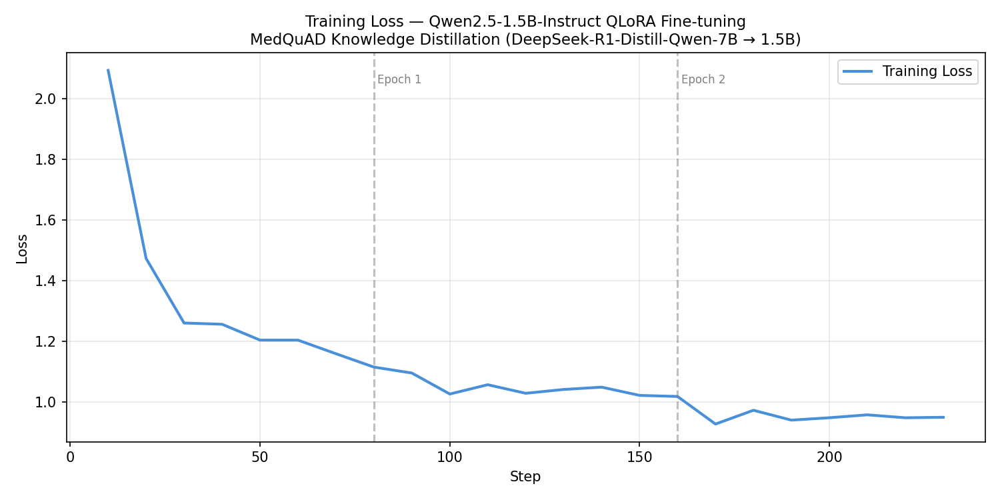
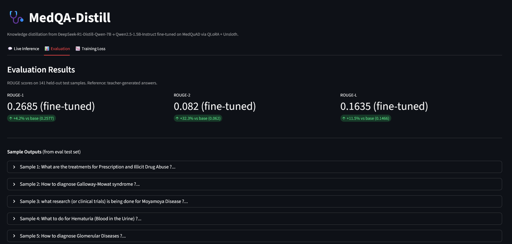

# MedQA_Distill

> Fine-tuning a small language model for medical Q&A using knowledge distillation — making a 1.5B parameter model approximate the quality of a 7B model at a fraction of the inference cost.

---

## Overview

This project demonstrates **knowledge distillation via supervised fine-tuning (SFT)** on a medical question-answering task.

A large **teacher model** (DeepSeek-R1-Distill-Qwen-7B) generates high-quality, patient-friendly answers to medical questions. A smaller **student model** (Qwen2.5-1.5B-Instruct) is then fine-tuned on those answers using QLoRA — learning to approximate the teacher's answer quality at a fraction of the size and inference cost.

The teacher itself is a distilled model — created by DeepSeek by distilling reasoning traces from the 671B parameter DeepSeek-R1 into a Qwen2.5-7B base. This makes it a strong teacher for medical QA: it produces structured, reasoned answers while remaining feasible to run locally on a consumer GPU. Both teacher and student share the same Qwen2.5 base architecture, ensuring tokenizer compatibility and a closer output distribution — a deliberate same-family distillation choice.

This mirrors production distillation pipelines used by models like DeepSeek-R1-Distill and Microsoft Phi-3.

**Dataset:** [lavita/MedQuAD](https://huggingface.co/datasets/lavita/MedQuAD) — 47k medical QA pairs sourced from 12 NIH websites (cancer.gov, MedlinePlus, GARD, and others).

---

## Pipeline

```
lavita/MedQuAD (47k rows)
        │
        ▼
preprocess.py           Filter + sample 2,000 QA pairs
        │
        ▼
generate_teacher.py     DeepSeek-R1-Distill-Qwen-7B generates enriched answers
                        <think> blocks stripped — final answers only kept
        │
        ▼
clean_teacher.py        Remove rows with unstripped reasoning traces (~30% filtered)
        │                1,401 clean samples retained
        ▼
finetune.py             90/10 train/test split → 1,260 train / 141 test
                        Unsloth FastLanguageModel + QLoRA + TRL SFTTrainer
                        Completion-only label masking (prompt tokens excluded from loss)
        │
        ▼
infer.py                Generate predictions from base + fine-tuned models on test set
        │                Saved to outputs/predictions.json
        ▼
metrics.py              ROUGE-1, ROUGE-2, ROUGE-L scoring
                        Saved to outputs/eval_results.json
        │
        ▼
app.py                  Streamlit demo — live inference + evaluation + loss curve
```

---

## Evaluation Results

Evaluated on **141 held-out test samples**. Reference: teacher-generated answers.

| Metric | Base Model   | Fine-tuned Student    | Improvement   |
|--------|--------------|-----------------------|---------------|
| ROUGE-1 | 0.2577      | 0.2685                | **+4.2%**     |
| ROUGE-2 | 0.0620      | 0.0820                | **+32.3%**    |
| ROUGE-L | 0.1466      | 0.1635                | **+11.5%**    |

**ROUGE-2** (bigram overlap) shows the strongest improvement — indicating the fine-tuned student better approximates the teacher's phrasing and answer structure on medical questions, consistent with successful domain adaptation via knowledge distillation.



---

## Sample Outputs

**Q: Is Trisomy 18 inherited?**

| **Base Model** | Trisomy 18 is not an inherited condition; it's a chromosomal disorder that occurs when there are three copies of chromosome 18 instead of the usual two. This extra genetic material leads to various physical and developmental problems, rather than being passed down from parents. The condition results from errors during cell division (meiosis) or during early embryonic development before conception. If you're concerned about your family history or risk factors for this type of genetic disorder, consulting with a genetic counselor can provide valuable information and guidance. |

| **Fine-tuned** | Trisomy 18 is not an inherited condition. It is a chromosomal disorder that occurs when there are three copies of chromosome 18 instead of the usual two, leading to various physical and developmental issues. This condition is not passed down from parents through their genes but rather arises due to random changes during cell division or other genetic factors. Therefore, Trisomy 18 cannot be considered an inherited trait. |

The fine-tuned student produces a more **concise, structured answer** without unnecessary hedging — reflecting the teacher model's patient-friendly answer style.

---

## Streamlit Demo

**Evaluation Tab**


---

## Tech Stack

| Component                     | Tool                                                                  |
|-------------------------------|-----------------------------------------------------------------------|
| Teacher model                 | DeepSeek-R1-Distill-Qwen-7B                                           |
| Student model                 | Qwen2.5-1.5B-Instruct                                                 |
| Fine-tuning framework         | [Unsloth](https://github.com/unslothai/unsloth) + TRL SFTTrainer      |
| Quantization                  | QLoRA (4-bit NF4, bfloat16)                                           |
| Dataset                       | lavita/MedQuAD (NIH-sourced)                                          |
| Evaluation                    | ROUGE-1/2/L (HuggingFace evaluate)                                    |
| Frontend                      | Streamlit + Plotly                                                    |

---

## Installation

```bash
conda create -n med_distill python=3.11
conda activate med_distill

# PyTorch nightly cu128 required for Blackwell (sm_120) GPUs
pip install --pre torch torchvision torchaudio \
    --index-url https://download.pytorch.org/whl/nightly/cu128

pip install datasets transformers peft trl accelerate bitsandbytes
pip install unsloth
pip install streamlit plotly matplotlib evaluate rouge_score
```

---

## Usage

```bash
# 1. Filter and sample dataset
python scripts/preprocess.py

# 2. Generate teacher labels (DeepSeek-R1-Distill-Qwen-7B)
python scripts/generate_teacher.py

# 3. Remove unstripped reasoning traces
python scripts/clean_teacher.py

# 4. Fine-tune student (Qwen2.5-1.5B-Instruct)
python scripts/finetune.py

# 5. Run inference on test set
python scripts/infer.py

# 6. Compute ROUGE metrics
python scripts/metrics.py

# 7. Plot training loss curve
python scripts/plot_loss.py

# 8. Launch Streamlit demo
streamlit run scripts/app.py
```

---

## Key Design Decisions

**Same-family distillation** — teacher and student are both Qwen2.5-based. This ensures tokenizer compatibility and a closer output distribution between teacher and student, reducing noise in training labels.

**Thinking trace stripping** — DeepSeek-R1-Distill generates `<think>...</think>` reasoning blocks before answering. These are stripped and only final answers are used as training labels. At 1.5B scale the student lacks capacity for coherent chain-of-thought generation — training on traces would add noise rather than signal.

**Completion-only label masking** — the student is trained to predict only the answer tokens, not the question or system prompt. This is handled via TRL's `completion_only_loss=True` flag.

**Data quality filtering** — ~30% of teacher-generated samples were identified as containing unstripped reasoning traces (model hit `max_new_tokens` before closing `</think>`). These were removed via `clean_teacher.py` before training.

---

## Limitations

- **Sample size** — 1,260 training samples used for demonstration. The pipeline is fully scalable to the complete filtered dataset via `--sample_size`.
- **Teacher generation speed** — single-sample autoregressive generation at ~3–4 samples/min on a consumer GPU. Production pipelines use vLLM or batched inference for higher throughput.
- **BERTScore** — incompatible with the nightly PyTorch build required for Blackwell GPUs. ROUGE scores are used instead.
- **Deployment** — the Streamlit demo is designed for local GPU deployment. A production setup would expose inference via a FastAPI endpoint and decouple it from the frontend.

---

## Related Projects

- [EU AI Act Navigator](../eu_ai_act_navigator) — Agentic RAG with LangGraph and pgvector
- [LLM Multi-Agent Recommender](../ecommerce_llm_recommender) — Explainable recommender with FAISS and FastAPI
