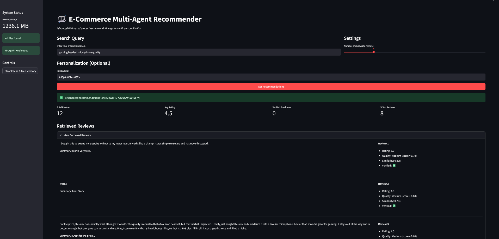
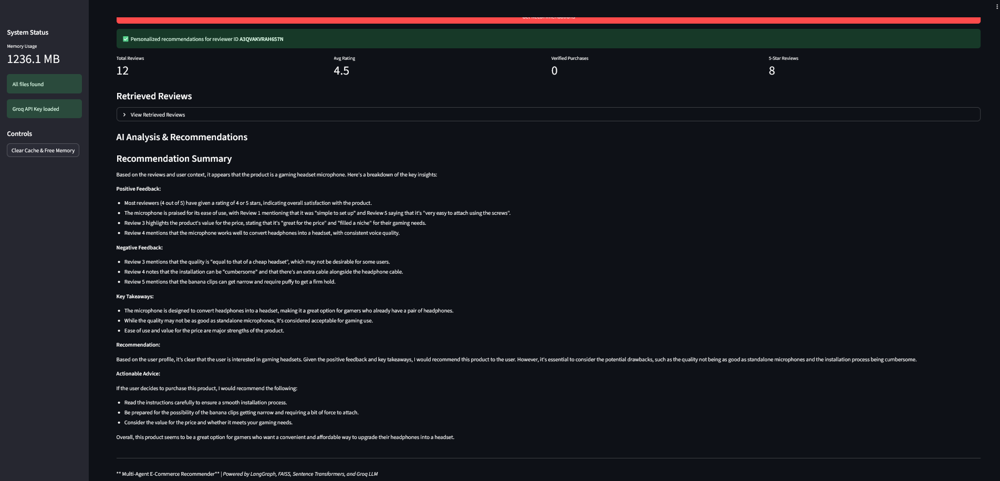

#  Public Project Showcase

Welcome! This repository is a showcase of my data science and machine learning projects, designed to demonstrate applied analytics, machine learning, and production-oriented AI engineering across real-world datasets and systems

Each folder in this repository contains a self-contained project.

---

##  Featured Projects

### [LLM-powered Multi-Agent Recommender](./ecommerce_llm_recommender)
- A production-minded, explainable recommendation system showcasing RAG, multi-agent orchestration, evaluation, and API design.
- **Objective:** Personalized, explainable e-commerce product recommendations using Retrieval-Augmented Generation (RAG), vector search, and multi-agent orchestration.
- **Impact / Highlights:**
  - End-to-end RAG pipeline using FAISS vector search and MiniLM embeddings for scalable semantic retrieval.
  - **Multi-agent architecture** (Retriever, User Profiler, Quality Analyzer, Explainer, Judge) orchestrated with LangGraph.
  - Explainable recommendations using review metadata (verified purchases, helpful votes, ratings, review quality scoring).
  - Optional personalized recommendations based on reviewer history and rating distributions.
  - Evaluation workflows:
    - **Offline LLM-as-a-Judge scoring:** Evaluate AI explanation quality (Relevance, Groundedness, Balance)
    - **Human-in-the-loop feedback dashboard (Reflex UI):** Review LLM explanations and provide structured ratings to improve scoring and model performance.
  - Multiple interfaces:
    - Interactive Streamlit UI for end-user recommendations: [Streamlit demo](https://ecomm-recommender.streamlit.app/)
    - FastAPI service layer exposing the LangGraph workflow for programmatic access and integration testing
    - **Docker-ready FastAPI:** The API can be containerized using Docker for isolated execution (Dockerfile included)
  - Designed with modularity, observability, and scalability in mind (chunked embeddings, Parquet storage)
- **Tech Stack:** Python, FastAPI, FAISS, Sentence-Transformers (MiniLM), LangGraph, Streamlit, Groq LLM API, Reflex
- [Detailed README](./ecommerce_llm_recommender/readme_llm.md)
  
## Screenshots

## Main Streamlit Application


## Explainable AI Recommendation



### [EU AI Act Navigator](./eu_ai_act_navigator) (ongoing)
- **Objective:** Agentic Retrieval-Augmented Generation (RAG) system for regulatory reasoning over the EU Artificial Intelligence Act.  
- **Highlights / Impact:**
  - Implements **planner-driven multi-hop retrieval**, treating each retrieval step as a reasoning decision.
  - Structured agent responsibilities:
    - **Planner Agent:** decides retrieval strategy, hop counts, and query reformulation.
    - **Retriever Agent:** performs vector-based search (pgvector / Supabase) with strict grounding.
    - **Explainer Agent:** synthesizes answers strictly from retrieved evidence, maintaining citations (e.g., *Article 6*, *Annex III*).
  - **Workflow Overview:**
```text
User Query
|
v
Planner Agent
(controls retrieval strategy)
|
v
Retriever Agent
(pgvector search, single or multi-hop)
|
v
Explainer Agent
(citation-bound synthesis)
|
v
Final Answer
```
  - Designed for **production-style AI engineering**:
    - Deterministic LangGraph execution graph for async, inspectable workflows.
    - Explicit state passing for testing, observability, and future scaling.
  - Retrieval and data layer:
    - EU AI Act segmented into Articles, Recitals, and Annexes.
    - Embedded with **Sentence-Transformers (MiniLM)** and stored in PostgreSQL + pgvector.
    - Metadata preserved for filtering, labeling, and citation.
  - Emphasis on **explainable, citation-bound outputs**, mirroring real-world enterprise or compliance AI pipelines.
- **Tech Stack:** Python, LangGraph, asyncio, Sentence-Transformers (MiniLM), PostgreSQL + pgvector (Supabase), Pytest, FastAPI, Streamlit
- [Detailed README](./eu_ai_act_navigator/README.md)

### [Music Review Summarization LLM QLoRA](./Music_Review_Summarization_LLM_QLoRA)
- **Objective:** Fine-tune a large language model for summarizing Amazon Digital Music reviews using QLoRA for memory-efficient instruction-following.
- **Impact / Highlights:**
  - Demonstrates instruction-following fine-tuning on a real-world dataset.
  - Efficient **4-bit QLoRA adapters** enable fine-tuning on small GPUs (OPT-1.3B).
  - Terminal-based multi-turn chatbot showcases interactive LLM inference.
  - Side-by-side comparison of **base vs fine-tuned adapter outputs** highlights performance improvements.
- **Tech Stack:** Python, Hugging Face Transformers, PEFT (QLoRA), PyTorch
- [detailed readme](./Music_Review_Summarization_LLM_QLoRA/readme.md)

### [Credit Card Fraud Detection](./Credit_fraud)
- **Objective:** Detect fraudulent transactions in a highly imbalanced dataset.
- **Highlights:** Achieved **F1 score of 0.86** using Random Forest with PCA and threshold tuning. Conducted a comparative analysis of **SMOTE vs. no-SMOTE approaches** across two notebooks to evaluate the impact on model performance.
- **Tech Stack:** Python, scikit-learn, imbalanced-learn (SMOTE), matplotlib

###  [M5 Forecasting – Retail Demand](./walmart)
- **Objective:** Forecast daily Walmart sales using time series models.
- **Highlights:** Built Prophet-based models with performance metrics **R²: 0.85**, **MAPE: 4%**.
- **Dashboard:** Deployed interactive Flask dashboard on [[Render.com](https://public-showcase.onrender.com)] to visualize:
  - Forecast vs actuals
  - Holiday impact by date & event type
- **Tech Stack:** Prophet, pandas, Flask, matplotlib, Plotly, Render.com

###  [Geospatial Data Pipeline – Brazil E-Commerce](./br_ecommerce)
- **Objective:** Build an end-to-end data pipeline to uncover trends.
- **Highlights:** Developed an automated **ELT pipeline** using **Dagster**. Transformed and visualized data into **geospatial heatmaps** 
- **Tech Stack:** SQL, python, Dagster, GeoPandas, pandas, DBT, great expectations, meltano

###  [EDA & Visualization – Mexico COVID-19](./mexico-covid)
- **Objective:** Perform exploratory analysis on COVID-19 cases and resource usage in Mexico.
- **Highlights:** Created insightful queries using visualizations to reveal patterns
- **Tech Stack:** Python, seaborn, matplotlib.

## Key Skills Demonstrated Across Projects
- **ML & AI:** Random Forest, PCA, Prophet, RAG, LLM integration, LLM fine-tuning (QLoRA), FAISS embeddings
- **Data Engineering:** ELT pipelines, Parquet storage, Dagster
- **Web / Visualization:** Flask, Streamlit, Plotly, interactive dashboards
- **Tools & Libraries:** Python, scikit-learn, pandas, PyArrow, GeoPandas, Sentence-Transformers, LangGraph, Hugging Face Transformers, PEFT
- **AI Engineering & Systems:** RAG pipelines, multi-agent orchestration (LangGraph), LLM evaluation, human-in-the-loop feedback
- **Backend & APIs:** FastAPI, Pydantic validation, RESTful AI services
- **Deployment & Scaling:** Streamlit, FAISS vector search, modular service-oriented design
