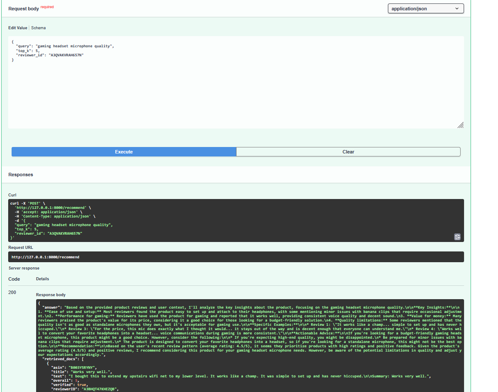

# Multi-Agent LLM Recommender with RAG & Explainability for E-Commerce

This project demonstrates a Retrieval-Augmented Generation (RAG) pipeline combined with multi-agent orchestration for personalized and explainable product recommendations based on Amazon Electronics 5-core reviews.

The system is designed for modularity, scalability, and explainability, showcasing LLM integration, vector search, and agentic AI workflows.

Explore the main Streamlit demo for personalized recommendations [here](https://ecomm-recommender.streamlit.app/)  or use the Reflex UI to inspect human feedback scoring for internal evaluation.


## Screenshots

### Main Streamlit Application


End-to-end Streamlit interface showing query input, personalization options, and retrieved reviews.

### Explainable AI Recommendation


LLM-generated explanation grounded in retrieved reviews with metadata-driven evidence.

### FastAPI API Testing (Swagger UI)



Swagger-based interface used to test the LangGraph-powered recommendation API,
including request validation, rate limiting, and end-to-end RAG execution.

### Screenshot Folder
Additional screenshots for offline LLM-as-a-Judge evaluation outputs are available in `assets/screenshots/`.

---

## Project Overview

This project builds an end-to-end recommender system using:

- Cleaned and enriched Amazon Electronics 5-core review data
- MiniLM embeddings stored in a FAISS IVF index for efficient similarity search
- Multi-agent architecture (**RetrieverAgent**, **ExplainerAgent**, **UserProfilerAgent**, **QualityAnalysisAgent**, **JudgeAgent**) orchestrated via LangGraph
- Explainable recommendations leveraging review metadata like verified purchase status, helpful votes, sentiment, and review quality scoring
- Optional personalized recommendations via reviewer ID

## Key Features

- Two Operational Workflows:
1. Direct RAG Pipeline: Sequential retrieval + explanation (lightweight, debugging-friendly)
2. LangGraph Orchestration: Multi-agent graph execution with conditional personalization and function/tool routing

- Personalized Recommendations: Tailor results based on reviewer ID, including user stats like total reviews, average rating, verified purchases, and 5-star distribution.

- Quality Scoring: Each review now includes a quality_label and quality_score to indicate reliability.

- LLM-as-a-Judge Evaluation to assess quality across relevance, groundedness, and helpfulness (see Workflow C)
  
- Human Feedback Loop (Reflex UI) to collect structured user feedback and ratings for continuous improvement (see Workflow D)

- Advanced RAG Features: Supports function calling and tool routing via LangGraph agents.

- Explainable Recommendations: Transparent reasoning using review metadata, highlighting pros, cons, and evidence from reviews

- Scalable Design: Parquet-based storage and chunked embeddings allow processing of large datasets

- API Access via FastAPI: Exposes the LangGraph-powered recommender as a REST endpoint for programmatic access, integration testing, and clean separation between frontend and backend (e.g. Streamlit).
  
---

## Code Modules

### Data & Embedding Pipeline

- **recommender/data/loader.py**  
  Loads raw Amazon Electronics JSON reviews, validates, and writes cleaned batches to parquet files.

- **recommender/data/preprocess.py**  
  Enriches reviews with metadata, vote bins, sentiment, and user profiles
  
- **recommender/data/embeddings.py**  
  Generates normalized embeddings from review text, chunked for scalability

- **scripts/build_index.py**  
  Builds and saves the FAISS IVF index from chunked `.npy` embedding files and maps vector IDs to parquet chunks.


### LLM Integration & Agents

- **agents/retriever_agent.py**  
  Loads FAISS index & metadata, embeds queries, executes similarity search, and returns detailed enriched review results.
  
- **agents/explainer_agent.py**  
  Builds RAG prompts and calls the Groq LLM to generate final, explainable answers referencing review metadata.

- **agents/userprofile_agent.py**
Manages user-specific data for personalized recommendations, Provides summary statistics: total reviews, average rating, verified purchase count, rating distribution
Enables the recommender to tailor retrieved reviews and AI-generated explanations based on a reviewer’s historical preferences

- **agents/quality_analysis_agent.py**
Evaluates retrieved reviews for reliability and usefulness. Produces quality_label and quality_score for each review to help the system prioritize high-quality content in explanations and recommendations.

- **agents/judge_agent.py**
Evaluates AI explanations for Relevance, Groundedness, and Balance

- **langgraph_nodes.py**
Defines LangGraph-compatible nodes for each agent and build_graph() to chain them together.
Enables flexible orchestration where each agent’s output feeds into the next node and supports function calling and tool routing.

### Human Feedback

- **human_feedback/human_feedback.py**
Allows humans to view and reevaluate LLM-as-a-Judge analysis outputs.
Saves human input as a JSON file under human_feedback/feedback_storage.

## Human Feedback Dashboard Features (Reflex UI)

This complements the Streamlit recommendation UI by providing an internal interface for evaluation and model improvement.

The Human Feedback Dashboard (Workflow D) is built using [Reflex](https://reflex.dev/) and provides a visual interface for human-in-the-loop evaluation and feedback.

### Core Features
- **Query Inspection:** Displays the user’s question and LLM-generated answer.  
- **Collapsible Sections:** View intermediate RAG retrieval results and final LLM explanations separately.  
- **Judge Score Display:** Shows automated LLM-as-a-Judge scores for Relevance, Groundedness, and Balance.  
- **Interactive Rating Form:** Allows users to rate the AI explanation quality using dropdowns and optional comments.  
- **Persistent Feedback Storage:** Saves all human ratings in `/human_feedback/feedback_storage/` for later analysis.  

### Example UI Flow:

Query → View Retrieved Reviews → Expand AI Explanation → View Judge Scores → Provide Human Ratings

Outputs are automatically stored as JSON files under:

```bash
human_feedback/feedback_storage/
```

## API Layer (FastAPI)

In addition to the Streamlit UI, the project includes a FastAPI-based service layer that exposes the LangGraph recommender workflow via a REST API.

This API is intended for:
- Programmatic testing of the RAG + multi-agent pipeline
- Integration with alternative frontends (e.g. Streamlit)
- Demonstrating clean separation between UI and backend logic

The API reuses the same `build_graph()` orchestration used by the Streamlit app and adds:
- Input validation with Pydantic
- Rate limiting
- Retry logic for transient failures
- Safe JSON serialization of NumPy-based outputs

## Internal Implementation Improvements (API)

The FastAPI backend has been refactored for better readiness monitoring:

- **Startup Lifecycle Refactor**: The LangGraph recommender is now initialized once at server startup, preventing double initialization and making startup failures observable.
- **Health Endpoint**: Added `/health` endpoint for service readiness and monitoring.

### Available Endpoint

**POST** `/recommend`

Request body:
```json
{
  "query": "gaming headset microphone quality",
  "top_k": 5,
  "reviewer_id": "A3QVAKVRAH657N"
}
```
Response includes:
- LLM-generated answer grounded in retrieved reviews
- Retrieved review metadata with quality scores
- Optional user profile summary (if reviewer_id is provided)
  
Run API locally
```bash
uvicorn backend.api:app --reload
```
fastapi UI at:
http://127.0.0.1:8000/docs

## Optional: Containerized FastAPI Service (Docker)

For deployment portability and environment isolation, the FastAPI service can optionally be run inside a Docker container.

This containerization is scoped **only to the FastAPI backend** and is not used by the Streamlit Cloud deployment, which runs directly from Python.

The provided `Dockerfile` demonstrates:
- Packaging the FastAPI API with its Python dependencies
- Loading the prebuilt FAISS index and metadata at startup
- Running the LangGraph-powered recommender via Uvicorn

This setup is intended to show how the API layer can be containerized in a production-style environment, without coupling it to the Streamlit frontend.

### Environment Variables

The FastAPI service requires the following environment variable:

- `GROQ_API_KEY` : API key for Groq LLM access

These variables are **not committed** to the repository and must be provided at runtime.

### Build and run (optional)

```bash
docker build -t fastapi-langgraph .
docker run -p 8000:8000 -e GROQ_API_KEY=your_key_here fastapi-langgraph
Alternatively, you may use a local .env file:
docker run -p 8000:8000 --env-file .env fastapi-langgraph
Once running, the API is available at:
http://localhost:8000/docs
```


## Workflows

### Workflow A: Direct RAG Pipeline

Runs retrieval + explanation sequentially via scripts/run_rag.py.

Suitable for debugging or lightweight mode

RetrieverAgent -> ExplainerAgent

Run command:

python -m scripts.run_rag --query "I want a durable laptop with long battery"

### Workflow B: LangGraph Orchestration [Streamlit UI](https://ecomm-recommender.streamlit.app/)

Uses build_graph() from agents/langgraph_nodes.py to orchestrate multiple agents in a graph execution model.

Supports personalized mode with reviewer profile (example ID: A3QVAKVRAH657N)

UserProfilerNode -> RetrieverNode -> QualityAnalysisNode -> ExplainerNode

Run command:

```bash
streamlit run app.py
```

Run via Streamlit front-end (app.py)

### Workflow C: Offline LLM Judge Evaluation (CLI)

Evaluate AI explanations automatically without the Streamlit UI using JudgeAgent.

Run command:

```bash
python -m scripts.offline_judge_runner
```

Outputs: JSON files with judge scores are saved under judge_outputs/. Example files already included:

judge_run_20250929-210527.json

judge_run_20250929-210529.json

Purpose: This workflow allows assessment of explanation quality (Relevance, Groundedness, Balance) offline.

### Workflow D: Human-in-the-Loop Feedback Dashboard (Reflex UI)

This workflow adds a Reflex-based web interface that allows human reviewers to inspect each LLM-as-Judge evaluation, view the AI explanation, and provide manual feedback to refine future scoring.

```bash
reflex run
```
### Workflow E: API-Based RAG & Recommendation Service (FastAPI)

Runs the LangGraph recommender behind a REST API for programmatic access and testing.

Suitable for:
- Backend integration testing
- Decoupled frontend/backend architecture demos
- Inspecting raw retrieval and explanation outputs

Run command:

```bash
uvicorn backend.api:app --reload
```

## Quick Start Guide

### 1. Install dependencies:
```bash
pip install -r requirements.txt
```

### 2. Workflow A: Direct RAG pipeline
```bash
python -m scripts.run_rag --query "I want a durable laptop with long battery"
```

### 3. Workflow B: LangGraph orchestration [Streamlit UI available](https://ecomm-recommender.streamlit.app/)
```bash
streamlit run app.py
```

### 4. Workflow C: Offline Judge (CLI)
```bash
python -m scripts.offline_judge_runner
```

### 5. Workflow D: Human-in-the-Loop Feedback Dashboard (Reflex UI)

This workflow adds a Reflex-based web interface that allows human reviewers to inspect each LLM-as-Judge evaluation, view the retrieved documents and AI explanation, and provide manual feedback to refine future scoring.

Run locally:

```bash
reflex run
```

